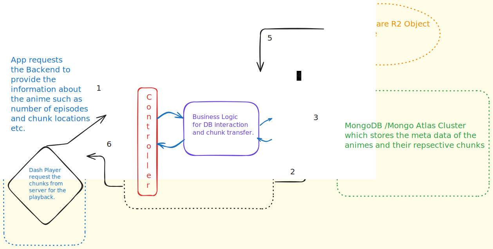

# Introduction

Hey There Everyone.This repository contains the backend source code for my anime Streaming application [ThunderStreams](https://thunderstreams_front.pages.dev).

It is built on NodeJS and leverages the use of `MongoDB Atlas` as the Database and `Cloudflare R2` as the Object Storage for storing `Dash` Chunks.

This application supports `ABR(Adaptive Bitrate Streaming)` which allows the network to change it's bandwidth or video quality as `720p,480p,360p` etc depending upon the internet speed.

# Architecture and Working

1. The user selects his/her favourite anime from the available list of series on the frontend and requests the backend to initiate the playback of that particular episode.

2. The Backend is responsible for fetching the meta-data about the episode from the MongoDB Atlas in Step 3

3. In next Step the backend now is aware of the video's chunks location and sends them back to the front-end as the response.

4. After that the Dash Player is feeded with path and url of the chunks location and request the chunks from the same backend for video play.

5. The Backend Controller now routes the request to the appropriate endpoint logic which then requests the Cloudflare R2 for the chunk.

6. The chunk in then sent to the Dash Player as a response in Step 6.

This cycle goes on as the playback proceeds.

Remember:- The Dash Player first asks for the `.mpd` file from the server as that file consists of meta data about the video being played including number of chunks for each quality , duration of each chunk,number of quality levels etc.

The Dash Player is built using [dashjs](https://www.npmjs.com/package/dashjs)

# Refrences

[CloudflareR2](https://www.cloudflare.com/en-in/developer-platform/products/r2/)

[Dashjs](https://dashjs.org/)

[MongoDBAtlas](https://www.mongodb.com/cloud/atlas)
